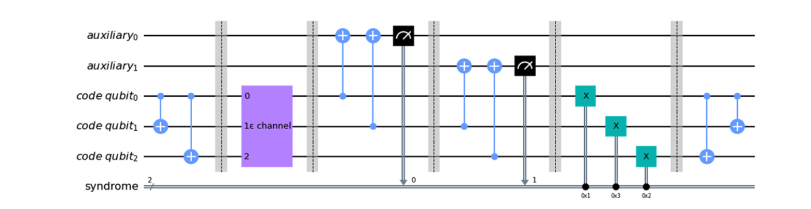
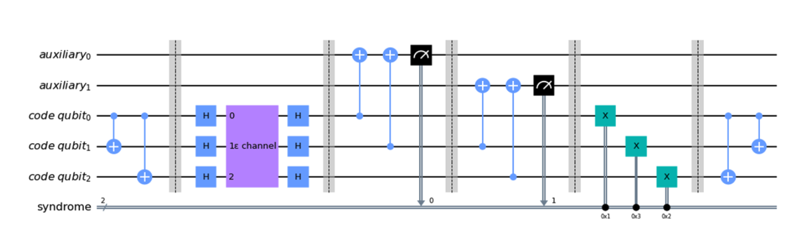

# Lab 9: Error Correction

Submit to Autograder by 11:55 pm Thu 4/2

[Starter Code](https://eecs479.github.io/lab-9/starter_code.zip)

[Qiskit Tutorials](https://docs.quantum.ibm.com/)

For this assignment you are to implement the provided functions in `lab_9.py`. Your code must pass all the tests listed in `test.py`. The autograder will confirm if you are getting the points for the test cases. There are no hidden test cases.

## Correcting Errors

In lecture, we discussed how pervasive noise is on real machines for even modest circuits. In order to have any hope of doing meaningful computation, we must have a way to detect and correct errors as they occur. We discussed the theory behind a bit-flip code, which can be augmented into a phase-flip code by adding Hadamard gates, and then a bit-flip and phase-flip oracle can be combined together to implement a general error correcting code. In this lab, you will get hands-on experience building these circuits and gain some familiarity with Qiskit's noise modeling feature.

## Modeling Noise

As with lecture, we will make the (large) assumption that noise will only affect a qubit's state in a given part of the circuit that we are designating as the "noisy channel". This may be realistic for a situation where a qubit needs to be stored for a prolonged period, perhaps waiting for some other computation to complete. In future lessons, we will learn how to generalize this process to handle when errors happen during gates or measurements.

We have provided a function in the starter code (`noisy_model`) which instructs Qiskit on how to probabilistically introduce this noise. The implementation details are that we designate a special identity gate to sporadically behave like an \(X\) gate, a \(Z\) gate, or both with some probability passed in as a parameter. This function returns a `Gate` object which can be placed in the design as the noisy channel, as well as a `NoiseModel` object describing how the errors should be applied, which must be passed to the execute function.

## Bit-flip Code

The circuit for the bit-flip code is shown below:



The epsilon channel can be implemented by calling the `noisy_model` function with the appropriate error probability for the given test.

The conditional \(X\) gates can be implemented using the `if_test` construct. For example, to flip the bit on qubit 0 if and only if the classical register `syndrome` has value 2:

```python
with qc.if_test((syndrome, 2)):
    qc.x(0)
```

The `noisy_model` function returns a single gate (since it does not necessarily know how many bits could be affected). You will need to append that single gate once to each qubit affected.

Once you have that working, you can use the bit-flip code to create a phase-flip code:



The autograder test cases will call `bitflip_code` and `phaseflip_code` to get your implementations of these circuits, and then pass them into `get_error_rate` along with an error model.

Your implementation of this function must simulate the execution of these circuits and report back what percentage of the time the bit-flip code does not recover from bit flips and what percentage of the time the phase-flip code does not recover from phase flips.

We recommend evaluating this by measuring the code bit over a large number of queries (about 1000) so that your result is sufficiently close to the theoretical result the autograder is expecting.

## Running Simulation for This Lab

We will need to run your experiments slightly differently for this lab (these details are already handled in the function `run_sim`):

1. Pass in the noise model generated by the `noisy_model` function.
2. Set `optimization_level=0` to prevent the noisy gate from being optimized out.

Since the inserted noisy gate is intended to behave like identity in the noiseless case, higher optimization levels can remove it. For this lab, we intentionally keep it so the noise effect remains in the simulation.

