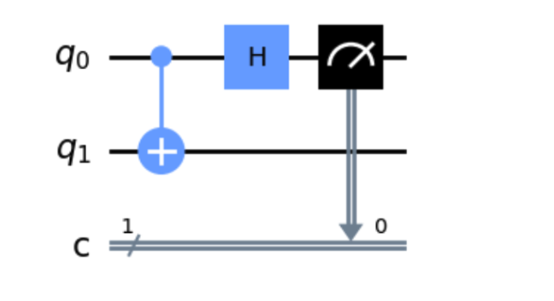
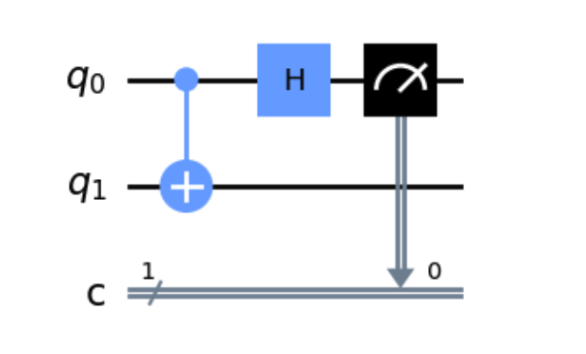
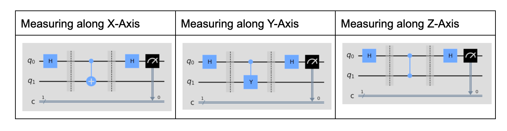

# Lab 4: Applying Phase Kickback

Submit to Autograder by 11:55 pm Thu 2/12

[Starter Code](https://eecs479.github.io/lab-4/starter_code.zip)

[Qiskit Tutorials](https://docs.quantum.ibm.com/)

## Pre-Lab Work (Not Submitted for Credit - Good prep for Exam)

It is recommended you complete these problems before working on the coding portion. They will help.

Write out the 2 eigenstates with corresponding eigenvalues \(1\) and \(-1\) for each of the \(X\), \(Y\), and \(Z\) gates, using column representation. We recommend performing matrix-vector multiplication to convince yourself that the eigenstates are unmodified by applying these operations except by a factor of the eigenvalue.

### X Gate

### Y Gate

### Z Gate

## Measuring along different axes of the Bloch sphere

So far, whenever we've measured a single qubit, we've said that we've been doing it along the \(Z\)-axis. This is because, on the \(Z\)-axis, \(\lvert 0\rangle\) is on the north pole of the \(Z\) axis, and \(\lvert 1\rangle\) is on the south pole. The closer a state is to the north pole on the Bloch sphere, the more likely it is we'll measure a \(0\), and the closer it is to the south pole the more likely we measure a \(1\).

Is there an equivalent way to do this, say, along the \(X\)-axis? I.e. the closer a state is to the \(\lvert +\rangle\) pole, the more likely it is we measure a \(0\), and the closer it is to the \(\lvert -\rangle\) state, the more likely we measure a \(1\)?

You implemented a way to do this in lab 2, by applying an \(H\) gate first, and then "measuring along the \(Z\)-axis" like normal. This works because \(H\) maps \(\lvert +\rangle\) to \(\lvert 0\rangle\) and \(\lvert -\rangle\) to \(\lvert 1\rangle\). But phase kickback allows us to do this directly on the original state, as long as we have an extra qubit. This strategy will be advantageous later, as we can measure more general properties of a state with fewer gates.

To better understand how this works, answer the next couple of problems on this circuit.

What will we measure if \(q_1\) is initialized to \(\lvert +\rangle\) and \(q_0\) is initialized to \(\lvert +\rangle\)?

What if \(q_1\) is initialized to \(\lvert -\rangle\)?

An arbitrary state is of course going to be something other than \(\lvert +\rangle\) or \(\lvert -\rangle\). But, as we discussed in lecture, \(\lvert +\rangle\) and \(\lvert -\rangle\) are orthogonal states. This means we can choose to represent any arbitrary state as scaled versions of these two states, rather than scaled versions of \(\lvert 0\rangle\) and \(\lvert 1\rangle\).

What is the state \(\sqrt{1/4}\lvert 0\rangle + \sqrt{3/4}\lvert 1\rangle\) expressed as a scaled sum of \(\lvert +\rangle\) and \(\lvert -\rangle\)? You can leave it approximated up to the nearest hundredth. (Try setting the coefficients for \(\lvert +\rangle\) and \(\lvert -\rangle\) as variables \(a\) and \(b\), expanding each \(\lvert +\rangle\) and \(\lvert -\rangle\) into the \(\lvert 0\rangle\) and \(\lvert 1\rangle\) basis, and solving for \(a\) and \(b\).)

Let's say that our qubit is in the state \(a\lvert +\rangle + b\lvert -\rangle\). While this state is not an eigenstate of the \(X\) operation, it is a superposition of two eigenstates: \(\lvert +\rangle\) and \(\lvert -\rangle\). We can see how each of these states evolves with phase kickback in our controlled-\(X\) circuit.

If \(q_1 = a\lvert +\rangle + b\lvert -\rangle\), and \(q_0 = \lvert +\rangle\), then applying a CX gate (with \(q_0\) as control and \(q_1\) as target) maps our combined state to:

$$\lvert q_1 q_0\rangle = a\lvert ++\rangle + b\lvert --\rangle$$

(since the "\(+\)" part of \(q_1\) kicks back a phase of \(+1\), leaving the control unmodified, and the "\(-\)" part kicks back a phase of \(-1\), changing the target to \(\lvert -\rangle\)).

Applying an \(H\) gate to \(q_0\) maps it to:

$$\lvert q_1 q_0\rangle = a\lvert +0\rangle + b\lvert -1\rangle$$

and if we measure \(q_0\), we'll get a "\(0\)" with probability \(\lvert a\rvert^2\), and "\(1\)" with probability \(\lvert b\rvert^2\). This is effectively measuring along the \(X\)-axis: we measured a \(0\) vs \(1\) based on how close the states were to the \(\lvert +\rangle\) and \(\lvert -\rangle\) poles.

We can generalize this to any axis. To measure a particular axis:

1. Identify the states which act as the two poles of the axis
2. Identify which gate these two states act as eigenstates for, with eigenvalues \(+1\) / \(-1\).
3. Create a controlled version of that gate in which the control qubit is initialized to \(\lvert +\rangle\) and the target qubit is what we're trying to measure.
4. After the controlled gate, apply the \(H\) gate to the control qubit
5. Measure the control qubit. If it's a \(0\), it means we have measured the qubit in the \(+1\) eigenstate; if we measure a \(1\), it means we have measured the qubit in the \(-1\) eigenstate.

Here are the circuits for the \(X\), \(Y\), and \(Z\) axis (note the controlled-\(Z\) gate is represented as a single line). We're assuming \(q_0\) is initialized to \(\lvert 0\rangle\), and \(q_1\) is the qubit we're trying to measure along the particular axis. Do they make sense?

## Autograder Portion

For the lab component, you will re-implement the functions from lab 2 to estimate the \(X\), \(Y\), and \(Z\) components of the Bloch sphere. However, now you will take in a circuit with 2 qubits, 1 classical bit, and the most significant qubit is in an unknown state. The least significant qubit is in state \(\lvert 0\rangle\).

You should measure the qubits along the specific axis by sandwiching a single controlled gate (with the unknown qubit as the target) between two \(H\) gates on the control qubit, and finally measuring the control qubit. You should get the same results as lab 2.

**Useful Qiskit methods:** `cx`, `cy`, `cz`
